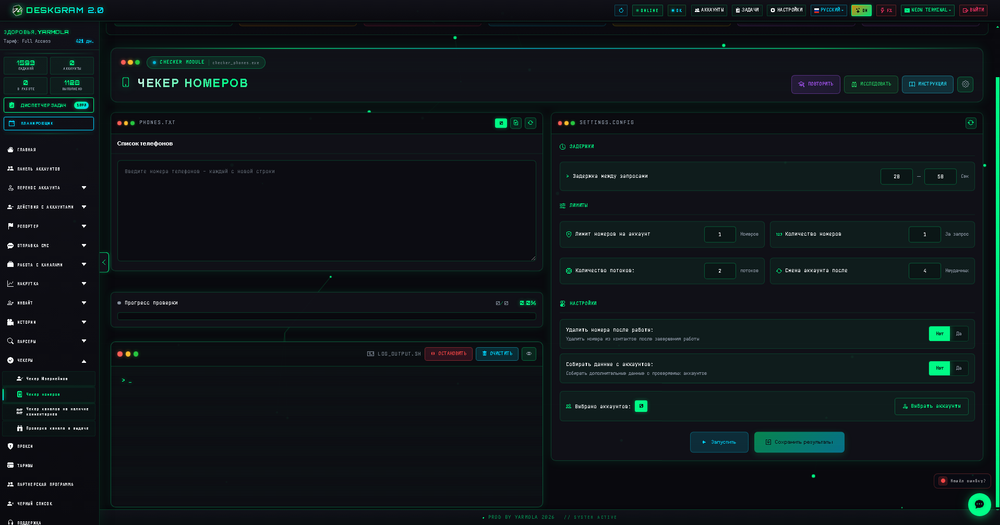
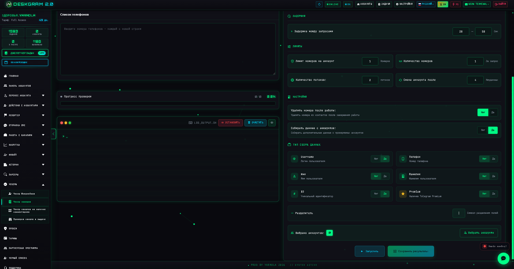
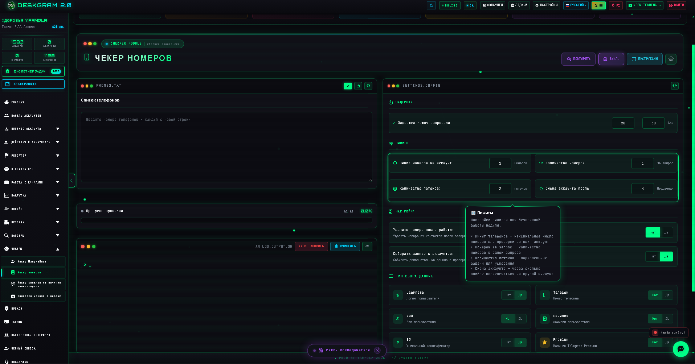
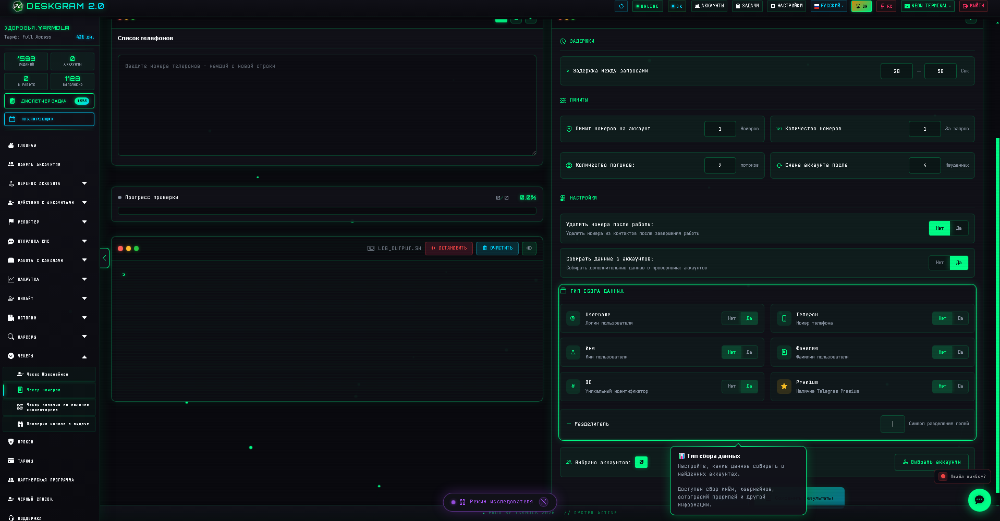

# Проверка телефонов в Telegram через Deskgram 2

Проверка телефонов в Deskgram 2 помогает быстро понять, какие номера зарегистрированы в Telegram, а какие нет. Этот модуль полезен, когда нужно почистить телефонную базу, сегментировать список перед outreach-сценарием и не тратить ресурсы на номера, которые не дадут результата.

[Главный хаб Deskgram 2](https://github.com/Deskgram-2/deskgram-2-telegram-automation) · [Сайт](https://deskgram2.com/) · [Telegram-бот](https://t.me/DG2welcomebot) · [Web preview](https://deskgram2.com/web-preview?path=%2Fapp-demo%2F&lang=ru)

## Интерактивный Web Preview

Попробовать модуль в браузере: [Открыть веб-превью](https://deskgram2.com/web-preview?path=%2Fapp-demo%2Ffunctions%2Fchecker_phones&lang=ru)

Это удобно, если хотите заранее посмотреть результаты проверки, лимиты и рабочие настройки еще до загрузки своей базы.

## Скриншоты

## Кратко о модуле

| Параметр | Что внутри |
|---|---|
| Основная задача | Проверка телефонных номеров на регистрацию в Telegram |
| Важные блоки | Список телефонов, результаты, статистика, лимиты, логи, выбор аккаунтов |
| Полезен для | Чистки баз, сегментации, подготовки outreach и invite-сценариев |
| Связанные модули | Сбор аудитории, Рассылка в ЛС, Инвайт |

## Что умеет модуль

- проверять, зарегистрирован ли номер в Telegram;
- показывать статистику по зарегистрированным и незарегистрированным номерам;
- задавать лимиты, задержки и логику сбора результатов;
- собирать и сохранять очищенный результат;
- готовить телефонную базу к следующим модулям.

## Быстрый старт

1. Загрузите список телефонов для проверки.
2. Настройте лимиты, задержки и параметры сохранения результатов.
3. Выберите аккаунты-исполнители.
4. Запустите проверку и следите за статистикой.
5. Используйте очищенную базу в следующем сценарии.

## С чем лучше сочетать

- [Сбор аудитории](https://github.com/Deskgram-2/telegram-audience-parser-deskgram), если база проверяется как часть более широкого сбора.
- [Рассылка в ЛС](https://github.com/Deskgram-2/telegram-direct-messaging-deskgram), если после фильтрации нужно идти в прямую коммуникацию.
- [Инвайт](https://github.com/Deskgram-2/telegram-invite-tool-deskgram), если очищенный список нужен для роста групп и каналов.
- [Панель аккаунтов](https://github.com/Deskgram-2/telegram-account-manager-deskgram), если важно заранее выбрать безопасную рабочую сетку для проверки.

## Когда особенно полезен

- когда база номеров большая и вручную ее не проверить;
- когда перед outreach нужно убрать шум и мертвые номера;
- когда важна сегментация по зарегистрированным пользователям;
- когда хочется экономить ресурсы на следующих сценариях.

## Что выбрать: проверку телефонов или сбор аудитории

| Если задача такая | Лучше использовать |
|---|---|
| Есть своя база номеров и нужно понять, кто есть в Telegram | [Проверка телефонов](https://github.com/Deskgram-2/telegram-phone-checker-deskgram) |
| Нужно собирать пользователей из каналов, чатов и групп | [Сбор аудитории](https://github.com/Deskgram-2/telegram-audience-parser-deskgram) |
| Нужен маршрут `проверить базу -> написать` | Проверка телефонов, затем рассылка |
| Нужен маршрут `найти аудиторию -> сегментировать -> написать` | Сбор аудитории, затем другие проверочные слои |

## Смежные репозитории

- [Главный хаб Deskgram 2](https://github.com/Deskgram-2/deskgram-2-telegram-automation)
- [Сбор аудитории](https://github.com/Deskgram-2/telegram-audience-parser-deskgram)
- [Рассылка в ЛС](https://github.com/Deskgram-2/telegram-direct-messaging-deskgram)
- [Инвайт](https://github.com/Deskgram-2/telegram-invite-tool-deskgram)
- [Панель аккаунтов](https://github.com/Deskgram-2/telegram-account-manager-deskgram)
- [Диспетчер задач](https://github.com/Deskgram-2/telegram-task-manager-deskgram)

## FAQ

### Можно ли сначала посмотреть модуль в браузере?

Да. В README уже есть ссылка на веб-превью, где можно посмотреть логику результатов, лимитов и сохранения данных до запуска реальной проверки.

### Этот модуль заменяет сбор аудитории?

Нет. Он решает другую задачу: валидирует уже имеющуюся телефонную базу, а не ищет новых пользователей в Telegram-среде.

### Когда phone checker особенно полезен перед рассылкой?

Когда исходная база сырая, смешанная или неизвестного качества. Тогда проверка телефонов помогает убрать мертвые номера и повысить качество следующего сценария.
